# Image Converter

## Create Lambda function that will convert JPEG to BMP, GIF, PNG.

### Add IAM role to Lambda function to full access S3 bucket

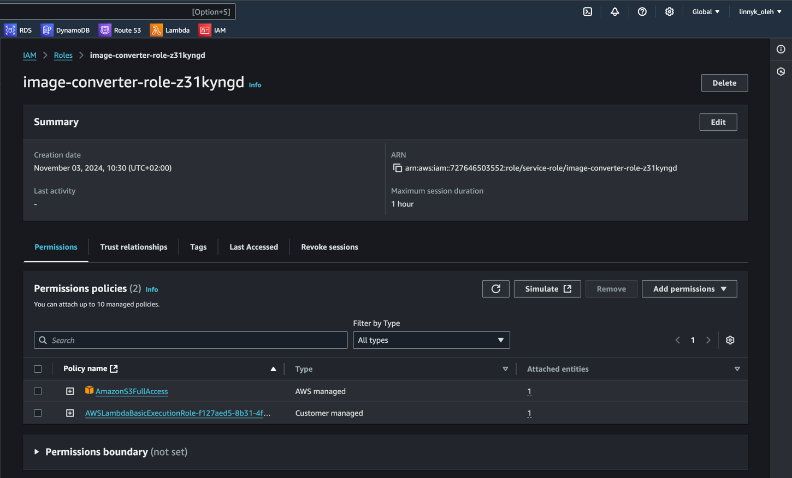

### Code for converting image

```java
public class ImageConverterLambda {

    private final AmazonS3 s3Client = AmazonS3ClientBuilder.defaultClient();

    public void handleRequest(S3Event s3Event, Context context) {
        System.out.println("Received event: " + s3Event);
        s3Event.getRecords().forEach(record -> {
            var bucketName = record.getS3().getBucket().getName();
            var key = record.getS3().getObject().getKey();
            try {
                var image = ImageIO.read(s3Client.getObject(bucketName, key).getObjectContent());

                uploadConvertedImage(bucketName, image, "bmp", "bmp/");
                uploadConvertedImage(bucketName, image, "gif", "gif/");
                uploadConvertedImage(bucketName, image, "png", "png/");

            } catch (IOException e) {
                context.getLogger().log("Error processing image: " + e.getMessage());
            }
        });
    }

    private void uploadConvertedImage(String bucketName, BufferedImage image, String format, String folder) throws IOException {
        var outputStream = new ByteArrayOutputStream();
        ImageIO.write(image, format, outputStream);
        var imageBytes = outputStream.toByteArray();

        var inputStream = new ByteArrayInputStream(imageBytes);
        var metadata = new ObjectMetadata();
        metadata.setContentLength(imageBytes.length);
        metadata.setContentType("image/" + format);

        var outputKey = folder + "converted_image." + format;
        var putRequest = new PutObjectRequest(bucketName, outputKey, inputStream, metadata);
        s3Client.putObject(putRequest);
    }
}
```

### Create S3 bucket and upload image

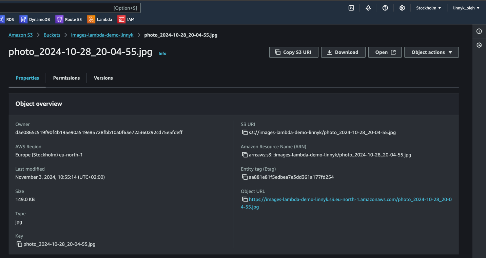

### Create Lambda function and add trigger from S3 bucket

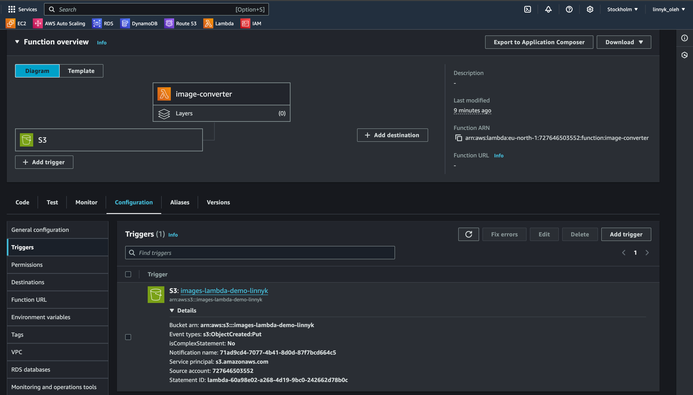

### Upload java code to Lambda function

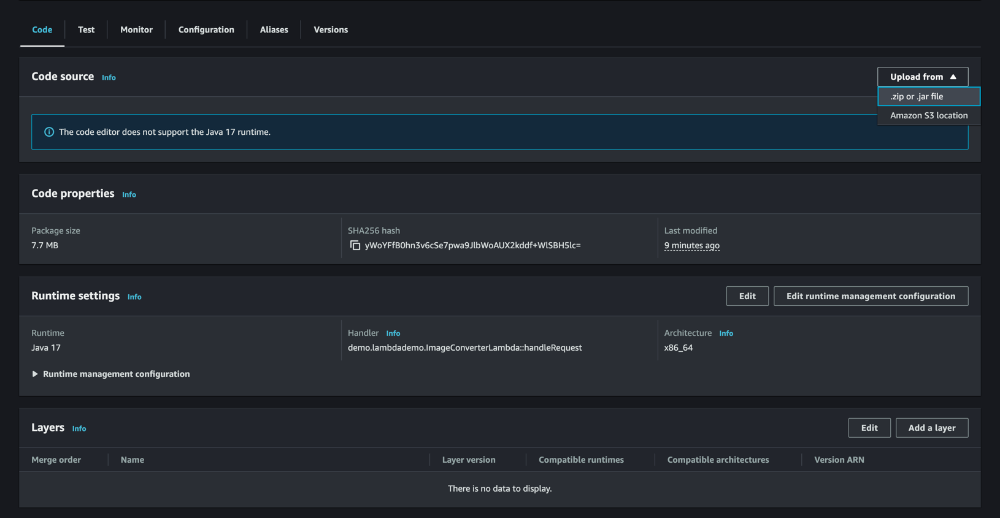

### Handler has to be the same as the class name and method name `demo.lambdademo.ImageConverterLambda::handleRequest` as [ImageConverterLambda.java](src/main/java/demo/lambdademo/ImageConverterLambda.java)

### After uploading image to S3 bucket, need to see three folders with converted images

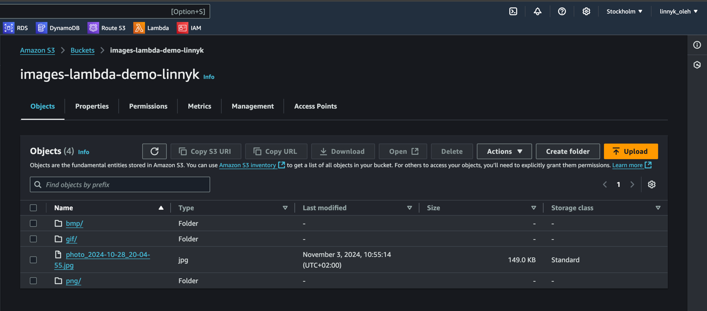

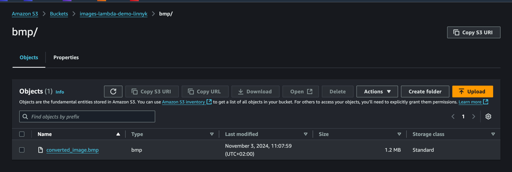

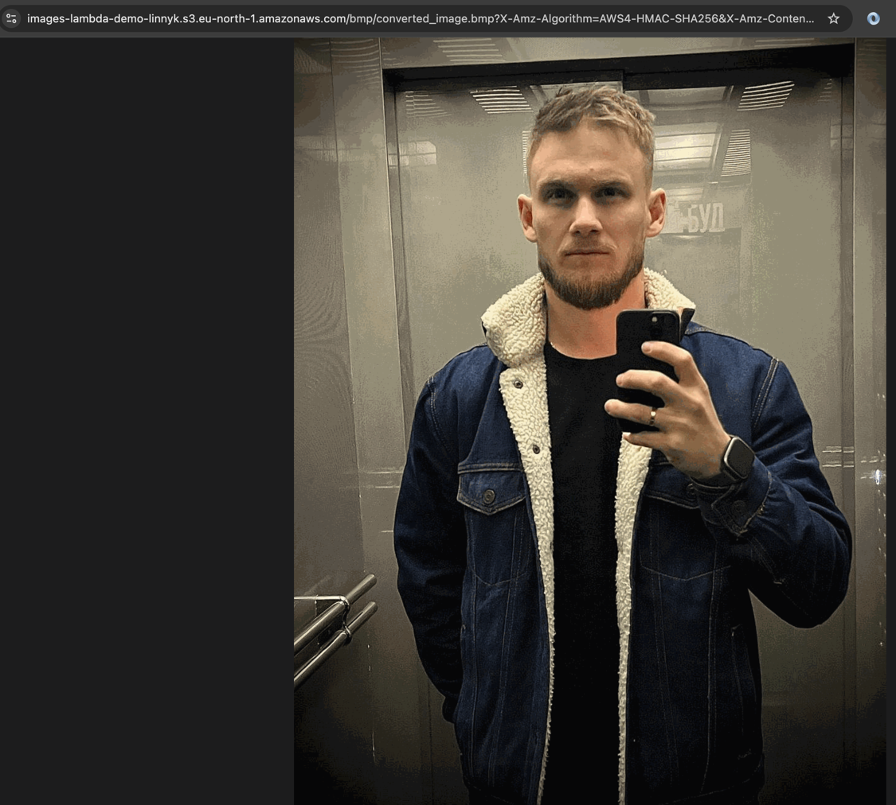

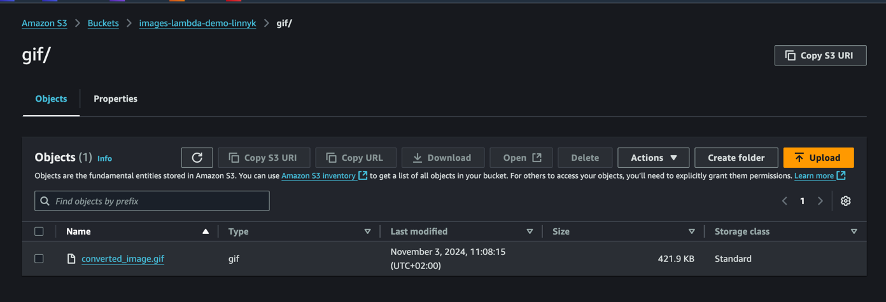


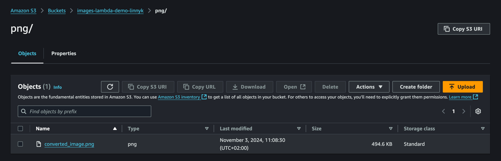

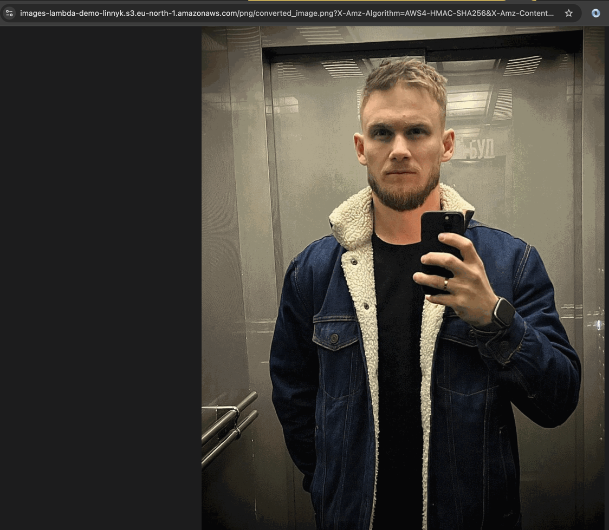

### Logs from Lambda function

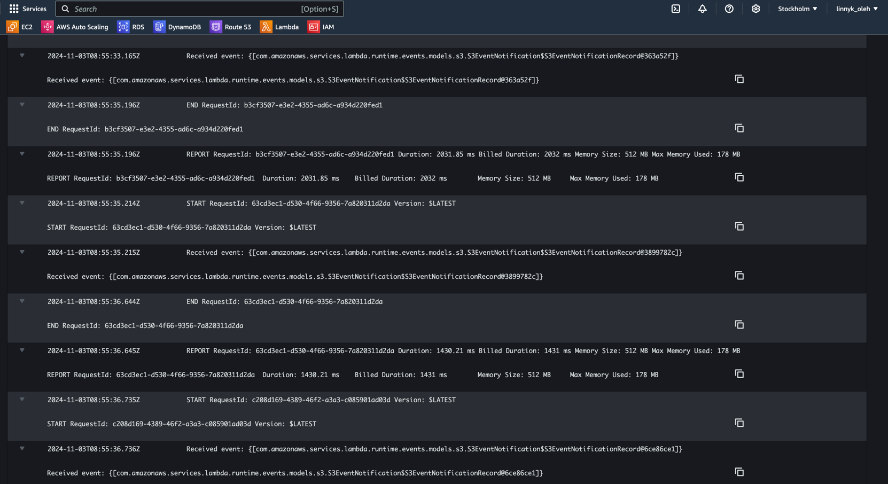


